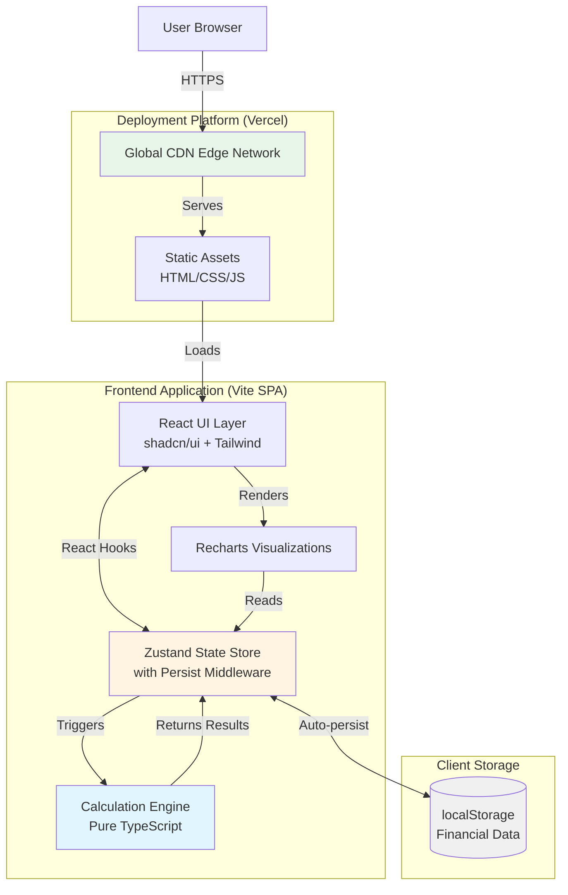
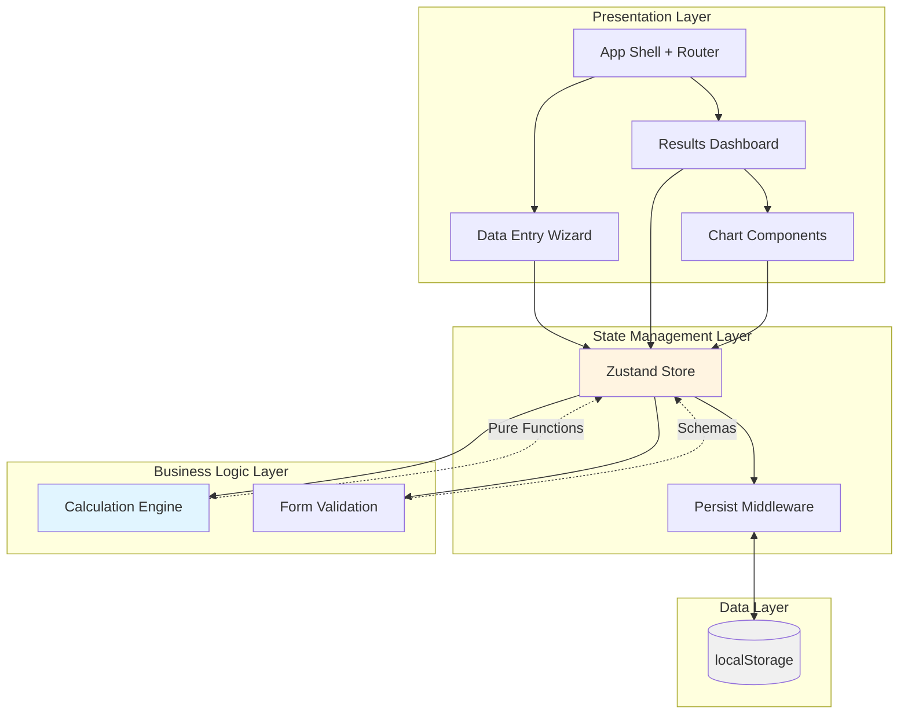
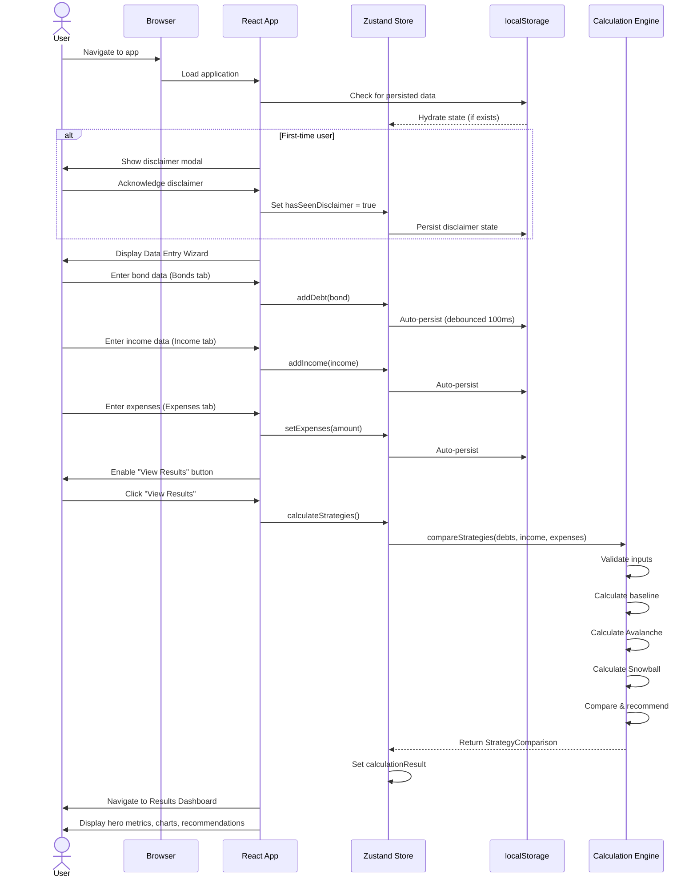
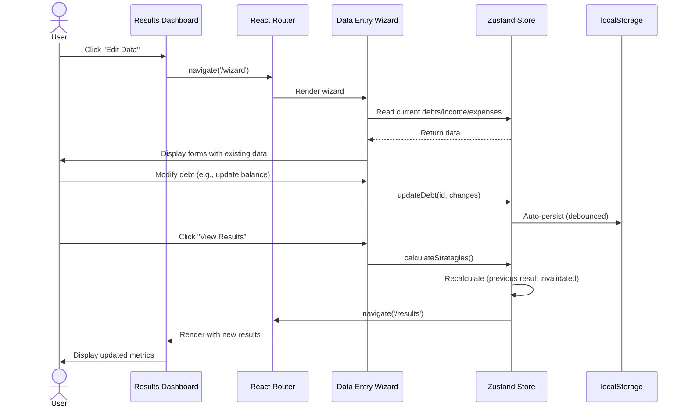
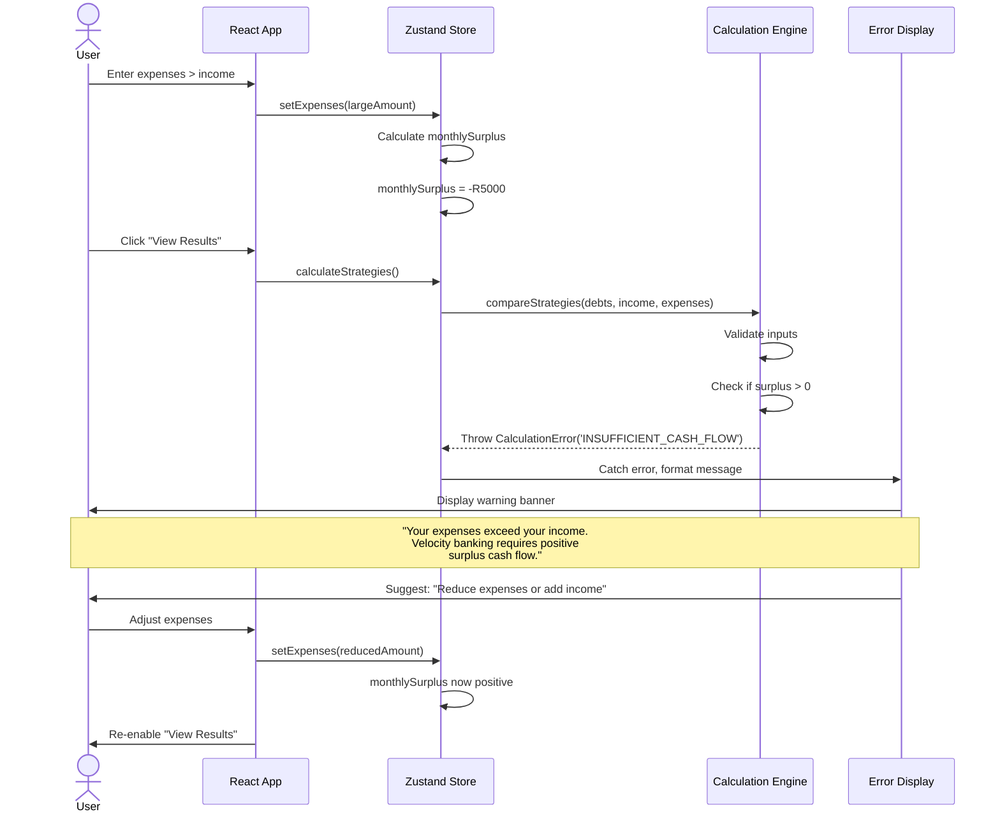
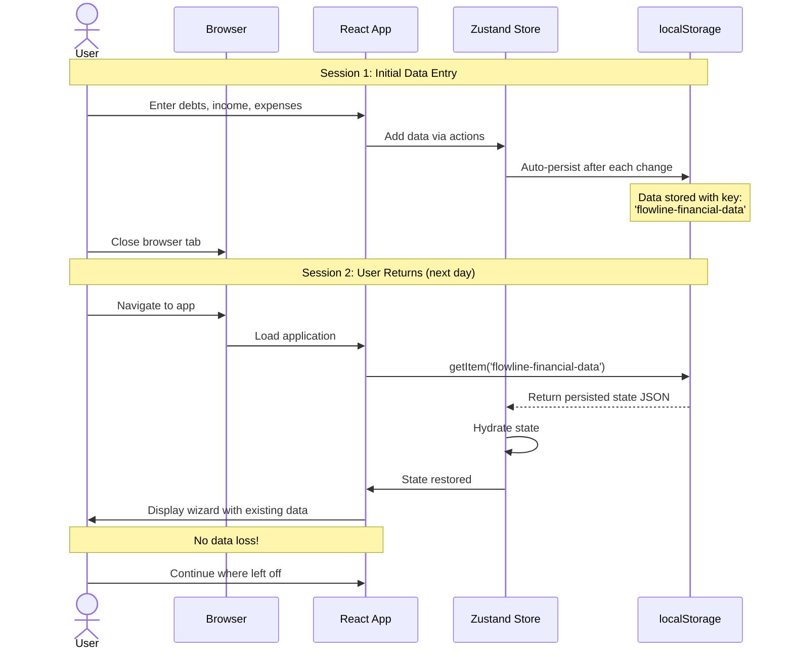

# Flowline Finance Studio - Full-Stack Architecture Document

**Version:** 1.0
**Date:** 2025-11-23
**Status:** In Progress

---

## Table of Contents

1. [Introduction](#introduction)
2. [High Level Architecture](#high-level-architecture)
3. [Tech Stack](#tech-stack)
4. [Data Models](#data-models)
5. [API Specification](#api-specification)
6. [Components](#components)
7. [External APIs](#external-apis)
8. [Core Workflows](#core-workflows)
9. [Database Schema](#database-schema)
10. [Frontend Architecture](#frontend-architecture)
11. [Backend Architecture](#backend-architecture)
12. [Source Tree](#source-tree)
13. [Development Workflow](#development-workflow)
14. [Deployment Architecture](#deployment-architecture)
15. [Security and Performance](#security-and-performance)
16. [Testing Strategy](#testing-strategy)
17. [Coding Standards](#coding-standards)
18. [Error Handling Strategy](#error-handling-strategy)
19. [Monitoring and Observability](#monitoring-and-observability)
20. [Checklist Results Report](#checklist-results-report)

---

## Introduction

This document outlines the complete fullstack architecture for **Flowline Finance Studio**, a specialized velocity banking calculator designed for the South African debt optimization market. While this MVP is entirely client-side (no backend), this architecture document uses fullstack structure to support the planned evolution to cloud-based features in v2.0.

The architecture serves as the single source of truth for AI-driven development, ensuring type-safe, performant implementation of complex financial calculations with a focus on accuracy, transparency, and user experience.

### Rationale

The decision to frame this as a "fullstack" architecture—despite being client-only for MVP—is deliberate:

1. **Future-proofing:** The PRD explicitly calls for v2.0 migration to cloud storage (Supabase/Firebase) with user accounts. Designing the calculation engine as a standalone module now will ease this transition.

2. **Clean separation:** Treating the calculation engine as a "backend-like" concern (pure business logic, isolated from UI) ensures testability and potential NPM package extraction (NFR14).

3. **Progressive architecture:** By documenting both current state (SPA) and migration path (API + cloud storage), we provide clear guidance for phased development.

### Trade-offs

- ✅ **Simplicity first:** No server complexity, instant deployment, zero hosting costs for MVP
- ✅ **Privacy by default:** All data stays client-side, POPIA compliant immediately
- ⚠️ **localStorage limitations:** ~5-10MB cap, no cross-device sync (acceptable for MVP, addressed in v2.0)
- ⚠️ **No real-time collaboration:** Single-user, single-device (acceptable given use case)

### Assumptions

- Users access the tool periodically (monthly/quarterly) to update calculations, not daily
- Desktop/tablet is primary access pattern for detailed financial planning
- Calculation complexity is manageable client-side (<500ms target for 10-debt scenarios)

### Change Log

| Date | Version | Description | Author |
|------|---------|-------------|--------|
| 2025-11-23 | 1.0 | Initial architecture document created | Winston (Architect Agent) |

---

## High Level Architecture

### Starter Template or Existing Project

**N/A - Greenfield Project**

This is a new project built from scratch. No existing starter template or codebase is being used. The project will be initialized using:

```bash
npm create vite@latest flowline-finance-studio -- --template react-ts
```

**Rationale:** Vite's React-TypeScript template provides minimal boilerplate while including essential configuration. This is preferred over heavier templates (Create React App, Next.js starter) because:
- The MVP has no SSR requirements
- No complex routing needs (2-3 views maximum)
- Fastest dev server and build times
- Modern ESM-first approach

shadcn/ui will be added post-initialization following their CLI setup process, which is well-documented and quick.

### Technical Summary

Flowline Finance Studio is a **client-side single-page application (SPA)** built with React 18, TypeScript, and Vite, deployed as static assets to Vercel or Netlify. The architecture prioritizes **calculation accuracy, developer velocity, and user privacy** through a clean separation between the calculation engine (pure TypeScript business logic) and the UI layer (React components).

The calculation engine implements sophisticated amortization modeling and velocity banking optimization algorithms, executing entirely in the browser with <500ms performance targets. State management via Zustand handles debt data, income sources, and calculation results, with automatic persistence to localStorage using the persist middleware. The UI layer leverages shadcn/ui (Radix + Tailwind) for accessible components and Recharts for SVG-based financial visualizations.

This architecture achieves the PRD's core goals: (1) 10-minute user insight through guided wizard UX, (2) <5% calculation accuracy variance through isolated, testable engine design, (3) POPIA compliance via local-only data storage, and (4) clear v2.0 migration path by designing the calculation engine as a portable module ready for extraction to NPM or backend service.

**Key Integration Points:**
- Calculation Engine ↔ Zustand Store (state mutations trigger recalculations)
- Zustand Store ↔ localStorage (bidirectional sync via persist middleware)
- React Components ↔ Zustand Store (reactive updates via hooks)
- Recharts Components ↔ Calculation Results (data transformation layer)

### Platform and Infrastructure Choice

**Analysis of Options:**

Given the PRD requirements (client-side SPA, no backend for MVP, static asset deployment), I've evaluated these platforms:

**Option 1: Vercel (RECOMMENDED)**
- **Pros:** Zero-config Next.js/React deployment, automatic HTTPS/SSL, global CDN, excellent DX (Git integration, preview deployments), generous free tier (100GB bandwidth), built-in analytics option
- **Cons:** Vendor lock-in, primarily optimized for Next.js (though works perfectly for Vite SPA)
- **Cost:** $0 for MVP (free Hobby tier)

**Option 2: Netlify**
- **Pros:** SPA-friendly, similar features to Vercel, form handling (useful for beta feedback), excellent Vite support, 100GB free tier
- **Cons:** Slightly slower build times vs Vercel, analytics are paid add-on
- **Cost:** $0 for MVP (free Starter tier)

**Option 3: GitHub Pages**
- **Pros:** Completely free, simple, integrated with GitHub
- **Cons:** No server-side headers (CORS issues possible), no preview deployments, manual SSL setup, less professional
- **Cost:** $0

**Recommendation: Vercel**

Vercel edges out Netlify due to superior Git integration, faster global CDN (matters for South African users accessing from multiple regions), and the future option to add Vercel Analytics (privacy-friendly, POPIA compliant). GitHub Pages is too limited for a production financial tool.

**Selected Platform:** Vercel
**Key Services:**
- Vercel CDN (global edge network)
- Automatic SSL/HTTPS
- Git-based deployments (main → production, PRs → preview)
- Optional: Vercel Analytics (post-launch)

**Deployment Host and Regions:**
- Global CDN with automatic edge routing
- Primary users in South Africa will be served from closest edge location
- No region restrictions needed for MVP

**Post-MVP Consideration:** When adding backend (v2.0), evaluate Vercel Serverless Functions vs. Supabase (PostgreSQL + Auth + Storage). Supabase likely better fit for user accounts + data persistence.

### Repository Structure

**Decision: Monorepo (Single Repository, Modular Structure)**

Given this is a solo developer MVP with a single frontend application and no separate backend services, a monorepo approach using **npm workspaces** or simple folder organization provides the right balance.

**Structure:**

```
flowline-finance-studio/
├── src/                          # Application source
│   ├── components/               # React UI components
│   ├── engine/                   # Calculation engine (isolated)
│   ├── state/                    # Zustand stores
│   ├── lib/                      # shadcn/ui components
│   ├── types/                    # TypeScript types
│   ├── utils/                    # Helper functions
│   └── App.tsx, main.tsx
├── public/                       # Static assets
├── docs/                         # Documentation (PRD, architecture, etc.)
└── tests/                        # Test files (co-located or separate)
```

**Rationale:**

- **Not a true monorepo** (no packages/apps split) because there's only one application
- **Modular folder structure** treats `engine/` as a conceptual "package" for future extraction
- **Simple and fast** for solo developer—no workspace tooling overhead
- **Migration path:** If v2.0 adds a separate backend, we can restructure to:
  ```
  packages/
    ├── web/          # Frontend (current src/)
    ├── engine/       # Shared calculation engine
    └── api/          # Backend (Supabase Edge Functions or Node API)
  ```

**Monorepo Tool:** None for MVP (simple folder structure)
**Package Organization:** Folder-based modules with explicit exports, using TypeScript path aliases for clean imports:

```typescript
// tsconfig.json
{
  "compilerOptions": {
    "paths": {
      "@/components/*": ["./src/components/*"],
      "@/engine/*": ["./src/engine/*"],
      "@/state/*": ["./src/state/*"],
      "@/types/*": ["./src/types/*"],
      "@/lib/*": ["./src/lib/*"]
    }
  }
}
```

### High Level Architecture Diagram



### Architectural Patterns

- **Single Page Application (SPA):** Client-side routing with React, all logic executes in browser - _Rationale:_ Eliminates server complexity, enables instant deployment, perfect for calculation-heavy tool with no backend data requirements

- **Component-Based UI with Atomic Design:** Small, reusable components (atoms) compose into larger patterns (molecules, organisms) - _Rationale:_ shadcn/ui provides atomic primitives; custom financial components (DebtCard, StrategyComparison) build on these for maintainability

- **State Management with Zustand:** Centralized store using Zustand with persist middleware - _Rationale:_ Minimal boilerplate vs Redux, perfect for financial data structure, built-in persistence simplifies localStorage sync

- **Pure Calculation Engine (Functional Core, Imperative Shell):** Business logic isolated in pure TypeScript functions with no React dependencies - _Rationale:_ Enables comprehensive unit testing (80%+ coverage target), supports NPM extraction (NFR14), clear separation of concerns

- **Local-First Architecture:** All data operations happen client-side with localStorage as source of truth - _Rationale:_ Privacy by default (POPIA compliant), zero server costs, instant read/write operations, works offline

- **Progressive Disclosure UI Pattern:** Simple by default, advanced features accessible but hidden initially - _Rationale:_ Serves both "Curious Beginner" and "Spreadsheet Master" personas without overwhelming either

- **Optimistic UI Updates:** UI updates immediately on user input with debounced persistence - _Rationale:_ Creates responsive, desktop-app-like feel (critical for 10-minute insight goal)

---

## Tech Stack

This is the **DEFINITIVE technology selection** for the entire project. All development must use these exact versions.

### Technology Stack Table

| Category | Technology | Version | Purpose | Rationale |
|----------|-----------|---------|---------|-----------|
| **Frontend Language** | TypeScript | 5.5+ | Primary development language | Type safety prevents calculation errors, excellent IDE support, enforces interfaces between modules |
| **Frontend Framework** | React | 18.3+ | UI component library | Industry standard, excellent ecosystem, hooks enable clean state logic, functional components align with calculation engine design |
| **UI Component Library** | shadcn/ui | Latest | Accessible component primitives | Radix UI base ensures WCAG AA compliance, Tailwind integration, copy-paste components (no npm bloat), professional financial aesthetic |
| **State Management** | Zustand | 4.5+ | Global application state | Minimal boilerplate, built-in persist middleware, excellent TypeScript support, <1KB overhead |
| **Build Tool** | Vite | 5.4+ | Dev server and build system | Fastest HMR (instant updates), native ESM, optimized production builds, perfect React-TS integration |
| **CSS Framework** | Tailwind CSS | 3.4+ | Utility-first styling | Rapid UI development, consistent design system, PurgeCSS removes unused styles, excellent with shadcn/ui |
| **Data Visualization** | Recharts | 2.12+ | Charts and graphs | React-native declarative API, SVG rendering (crisp on retina), responsive, adequate performance for 360-point datasets |
| **Form Management** | React Hook Form | 7.52+ | Performant form handling | Minimal re-renders, excellent Zod integration, built-in validation, perfect for multi-step wizard |
| **Schema Validation** | Zod | 3.23+ | Runtime type validation | TypeScript inference, composable schemas, clear error messages, shared types between validation and TS |
| **Routing** | React Router | 6.24+ | Client-side navigation | Standard SPA routing, supports nested routes, type-safe with TypeScript, simple for 2-3 view app |
| **Icons** | Lucide React | 0.395+ | Icon system | Tree-shakeable, consistent design, excellent financial/UI icons, lightweight |
| **Date Handling** | date-fns | 3.6+ | Date calculations | Immutable, tree-shakeable, South African locale support, lighter than Moment.js |
| **Testing Framework** | Vitest | 1.6+ | Unit and integration tests | Vite-native (shared config), Jest-compatible API, fast execution, excellent TypeScript support |
| **React Testing** | React Testing Library | 16.0+ | Component testing | Best practices (test user behavior not implementation), accessibility-focused, works with Vitest |
| **Linting** | ESLint | 8.57+ | Code quality | TypeScript + React rules, catches errors pre-runtime, enforces coding standards |
| **Code Formatting** | Prettier | 3.3+ | Consistent code style | Zero config, integrates with ESLint, prevents style debates |
| **Type Checking** | TypeScript Compiler | 5.5+ | Static analysis | Strict mode enabled, catches type errors, documentation via types |
| **Package Manager** | npm | 10+ | Dependency management | Default with Node.js, lockfile ensures reproducibility, adequate performance for solo dev |
| **Version Control** | Git | 2.40+ | Source control | Industry standard, GitHub integration, tag-based releases |
| **Deployment Platform** | Vercel | N/A | Static hosting and CDN | Zero-config Vite deployment, automatic HTTPS, global CDN, preview deployments |
| **Analytics** | Plausible | N/A (Script) | Privacy-friendly analytics | POPIA/GDPR compliant, no cookies, simple event tracking, lightweight script |
| **Error Tracking** | (Optional v1.1+) | TBD | Runtime error monitoring | Deferred to post-launch, consider Sentry or Vercel Error Tracking |

---

## Data Models

The data models represent the core business entities that flow between the UI, state management, and calculation engine. These TypeScript interfaces serve as the single source of truth for type safety across the application.

### Debt (Union Type)

**Purpose:** Represents any type of debt the user wants to optimize. Supports bonds (with/without flexi facilities), car loans, personal loans, and credit cards.

**Key Attributes:**
- `id`: string - Unique identifier (UUID v4)
- `type`: 'bond' | 'loan' | 'credit-card' - Discriminator for union type
- `name`: string - User-friendly label (e.g., "Primary Home Bond", "Honda Civic Loan")
- `balance`: number - Current outstanding balance in ZAR
- `interestRate`: number - Annual interest rate as percentage (e.g., 11.5 for 11.5%)
- `monthlyPayment`: number - Minimum monthly payment in ZAR
- `hasFlexiFacility`: boolean - (Bonds only) Whether bond has flexi access
- `loanType`: 'car' | 'personal' - (Loans only) Sub-type of loan
- `term`: number - (Bonds/Loans only) Original loan term in years

#### TypeScript Interface

```typescript
// Base debt properties shared by all types
interface BaseDebt {
  id: string;
  name: string;
  balance: number;
  interestRate: number;
  monthlyPayment: number;
  createdAt: string; // ISO 8601 timestamp
  updatedAt: string; // ISO 8601 timestamp
}

// Home bond with optional flexi facility
interface Bond extends BaseDebt {
  type: 'bond';
  hasFlexiFacility: boolean;
  term: number; // Original term in years
  originalBalance?: number; // Optional: original loan amount
}

// Car or personal loan
interface Loan extends BaseDebt {
  type: 'loan';
  loanType: 'car' | 'personal';
  term: number; // Remaining term in years
}

// Credit card debt
interface CreditCard extends BaseDebt {
  type: 'credit-card';
  creditLimit?: number; // Optional: total credit limit
}

// Discriminated union type
type Debt = Bond | Loan | CreditCard;
```

#### Relationships

- One-to-many with `CalculationResult` (each debt appears in calculation output)
- Referenced by `DebtPayoffSequence` (prioritization order)

### IncomeSource

**Purpose:** Represents any source of income that contributes to debt repayment capacity.

**Key Attributes:**
- `id`: string - Unique identifier
- `name`: string - Label (e.g., "Salary", "Rental Income", "Freelance")
- `amount`: number - Income amount in ZAR
- `frequency`: 'monthly' | 'bi-weekly' - Payment frequency

#### TypeScript Interface

```typescript
interface IncomeSource {
  id: string;
  name: string;
  amount: number; // ZAR
  frequency: 'monthly' | 'bi-weekly';
  createdAt: string;
  updatedAt: string;
}

// Helper type for normalized monthly income
interface NormalizedIncome {
  totalMonthly: number; // Bi-weekly converted to monthly
  sources: Array<{
    id: string;
    name: string;
    monthlyAmount: number; // Normalized to monthly
  }>;
}
```

#### Relationships

- Aggregated into `totalMonthlyIncome` calculation
- Used by calculation engine to determine surplus cash flow

### ExpenseBudget

**Purpose:** Represents user's total monthly living expenses (single aggregate for MVP).

**Key Attributes:**
- `monthlyTotal`: number - Total monthly expenses in ZAR
- `updatedAt`: string - Last modification timestamp

#### TypeScript Interface

```typescript
interface ExpenseBudget {
  monthlyTotal: number; // ZAR
  updatedAt: string;
  // Future expansion (v2.0):
  // breakdown?: {
  //   housing?: number;
  //   utilities?: number;
  //   groceries?: number;
  //   transport?: number;
  //   other?: number;
  // };
}
```

#### Relationships

- Subtracted from total income to calculate `monthlySurplus`
- Critical input for velocity banking calculations

### CalculationResult

**Purpose:** Represents the output of calculation engine for a given strategy (Avalanche or Snowball).

**Key Attributes:**
- `strategy`: 'avalanche' | 'snowball' | 'baseline' - Strategy type
- `totalInterestPaid`: number - Total interest paid across all debts (ZAR)
- `totalMonthsToDebtFree`: number - Time to pay off all debts (months)
- `debtFreeDate`: Date - Projected debt-free date
- `monthlySurplus`: number - Available cash flow for debt acceleration (ZAR)
- `debtPayoffSequence`: DebtPayoffSequence[] - Order and timing of debt payoff
- `monthlySnapshots`: MonthlySnapshot[] - Balance over time for charting

#### TypeScript Interfaces

```typescript
interface CalculationResult {
  strategy: 'avalanche' | 'snowball' | 'baseline';
  totalInterestPaid: number; // ZAR
  totalMonthsToDebtFree: number;
  debtFreeDate: Date;
  monthlySurplus: number; // ZAR
  debtPayoffSequence: DebtPayoffSequence[];
  monthlySnapshots: MonthlySnapshot[];
  calculatedAt: string; // ISO 8601 timestamp
}

interface DebtPayoffSequence {
  debtId: string;
  debtName: string;
  priority: number; // 1 = first, 2 = second, etc.
  startMonth: number; // Month when focus shifts to this debt
  endMonth: number; // Month when debt is paid off
  interestPaid: number; // Interest paid on this specific debt (ZAR)
}

interface MonthlySnapshot {
  month: number; // 0 = start, 1 = first month, etc.
  date: Date; // Actual calendar date
  totalDebtBalance: number; // Sum of all debt balances (ZAR)
  debts: Array<{
    debtId: string;
    balance: number; // Individual debt balance
    interestPaid: number; // Interest paid this month
    principalPaid: number; // Principal paid this month
  }>;
}
```

#### Relationships

- Generated by calculation engine, stored in Zustand state
- Consumed by chart components and results dashboard
- Referenced by strategy comparison logic

### StrategyComparison

**Purpose:** Compares Avalanche vs Snowball strategies to recommend optimal approach.

**Key Attributes:**
- `avalancheResult`: CalculationResult - Avalanche strategy outcome
- `snowballResult`: CalculationResult - Snowball strategy outcome
- `recommendedStrategy`: 'avalanche' | 'snowball' | 'similar' - AI recommendation
- `rationale`: string - Explanation of recommendation
- `interestDifference`: number - Delta in total interest (ZAR)
- `timeDifference`: number - Delta in months to debt-free

#### TypeScript Interface

```typescript
interface StrategyComparison {
  avalancheResult: CalculationResult;
  snowballResult: CalculationResult;
  recommendedStrategy: 'avalanche' | 'snowball' | 'similar';
  rationale: string;
  interestDifference: number; // ZAR (positive = Avalanche saves more)
  timeDifference: number; // Months (positive = Avalanche faster)
  comparedAt: string; // ISO 8601 timestamp
}

// Recommendation logic thresholds (configurable)
interface RecommendationThresholds {
  significantInterestSaving: number; // Default: R10,000
  significantTimeSaving: number; // Default: 6 months
  minimalDifference: number; // Default: R5,000
}
```

#### Relationships

- Aggregates two `CalculationResult` objects
- Drives UI display in strategy comparison cards
- Powers "Next Steps" guidance

### ApplicationState (Zustand Store Shape)

**Purpose:** Root state shape for Zustand store with persist middleware.

#### TypeScript Interface

```typescript
interface ApplicationState {
  // Core data
  debts: Debt[];
  incomeSources: IncomeSource[];
  expenseBudget: ExpenseBudget | null;

  // Calculation results
  calculationResult: StrategyComparison | null;

  // UI state
  activeWizardTab: 'bonds' | 'loans' | 'income' | 'expenses';
  hasSeenDisclaimer: boolean;

  // Actions (not persisted)
  addDebt: (debt: Omit<Debt, 'id' | 'createdAt' | 'updatedAt'>) => void;
  updateDebt: (id: string, updates: Partial<Debt>) => void;
  removeDebt: (id: string) => void;
  addIncome: (income: Omit<IncomeSource, 'id' | 'createdAt' | 'updatedAt'>) => void;
  updateIncome: (id: string, updates: Partial<IncomeSource>) => void;
  removeIncome: (id: string) => void;
  setExpenses: (budget: number) => void;
  calculateStrategies: () => void;
  clearAllData: () => void;
  setActiveTab: (tab: ApplicationState['activeWizardTab']) => void;
  acknowledgeDisclaimer: () => void;
}
```

#### Relationships

- Persisted to localStorage via Zustand persist middleware
- Consumed by all React components via hooks
- Actions trigger calculation engine functions

---

## API Specification

**Assessment:** This MVP is a client-side SPA with no backend API. All calculations execute in the browser, and data is stored in localStorage. Therefore, traditional REST/GraphQL/tRPC API specifications are **not applicable for v1.0**.

However, this section documents the **internal calculation engine API** (the contract between UI and calculation logic) and the **v2.0 migration path** to a proper backend API.

### Internal Calculation Engine API (v1.0 MVP)

The calculation engine exposes pure TypeScript functions that act as an "internal API" for the application. These functions are consumed by Zustand store actions.

#### Function Signatures

```typescript
// src/engine/calculator.ts

/**
 * Calculate baseline amortization (traditional repayment with no optimization)
 */
export function calculateBaseline(
  debts: Debt[],
  income: NormalizedIncome,
  expenses: ExpenseBudget
): CalculationResult;

/**
 * Calculate velocity banking strategy (flexi facility optimization)
 * with Avalanche prioritization (highest interest rate first)
 */
export function calculateAvalanche(
  debts: Debt[],
  income: NormalizedIncome,
  expenses: ExpenseBudget
): CalculationResult;

/**
 * Calculate velocity banking strategy (flexi facility optimization)
 * with Snowball prioritization (smallest balance first)
 */
export function calculateSnowball(
  debts: Debt[],
  income: NormalizedIncome,
  expenses: ExpenseBudget
): CalculationResult;

/**
 * Compare Avalanche vs Snowball and recommend optimal strategy
 */
export function compareStrategies(
  debts: Debt[],
  income: NormalizedIncome,
  expenses: ExpenseBudget,
  thresholds?: RecommendationThresholds
): StrategyComparison;

/**
 * Validate input data before calculation
 * @throws ValidationError with user-friendly messages
 */
export function validateCalculationInputs(
  debts: Debt[],
  income: NormalizedIncome,
  expenses: ExpenseBudget
): { valid: boolean; errors: string[] };
```

#### Example Usage (from Zustand store)

```typescript
// src/state/financialStore.ts
import { compareStrategies } from '@/engine/calculator';

const useFinancialStore = create<ApplicationState>()(
  persist(
    (set, get) => ({
      // ... state fields

      calculateStrategies: () => {
        const { debts, incomeSources, expenseBudget } = get();

        if (!expenseBudget || debts.length === 0 || incomeSources.length === 0) {
          throw new Error('Insufficient data for calculation');
        }

        const normalizedIncome = normalizeIncome(incomeSources);
        const result = compareStrategies(debts, normalizedIncome, expenseBudget);

        set({ calculationResult: result });
      },
    }),
    {
      name: 'flowline-financial-data',
      partialize: (state) => ({
        // Only persist data, not calculation results or actions
        debts: state.debts,
        incomeSources: state.incomeSources,
        expenseBudget: state.expenseBudget,
        activeWizardTab: state.activeWizardTab,
        hasSeenDisclaimer: state.hasSeenDisclaimer,
      }),
    }
  )
);
```

#### Error Handling

All calculation functions follow consistent error handling:

```typescript
// src/engine/errors.ts

export class CalculationError extends Error {
  constructor(
    message: string,
    public code: 'INSUFFICIENT_CASH_FLOW' | 'INVALID_INTEREST_RATE' | 'CALCULATION_OVERFLOW',
    public details?: Record<string, any>
  ) {
    super(message);
    this.name = 'CalculationError';
  }
}

// Example usage in calculation engine:
if (monthlySurplus <= 0) {
  throw new CalculationError(
    'Your expenses exceed or equal your income. Velocity banking requires positive surplus cash flow.',
    'INSUFFICIENT_CASH_FLOW',
    { totalIncome, totalExpenses, surplus: monthlySurplus }
  );
}
```

### v2.0 API Migration Path (Future Backend)

When user accounts and cloud storage are added in v2.0, the application will introduce a backend API. This section documents the planned approach.

**Recommended Stack:**
- **Supabase** (PostgreSQL + Auth + Storage + Edge Functions)
- **tRPC** for type-safe client-server communication
- **Alternative:** Vercel Serverless Functions + Prisma + NextAuth

**Migration Strategy:**

1. **Phase 1 (v1.0):** Pure client-side, no API
2. **Phase 2 (v1.5):** Add backend for user accounts and scenario storage, keep calculations client-side
3. **Phase 3 (v2.0):** Optionally move calculations to backend for:
   - Server-side validation and audit trails
   - Heavy computations (100+ debt scenarios, Monte Carlo simulations)
   - ML-powered recommendations

### No External API for v1.0

**Confirmation:** The MVP does **not** integrate with any external APIs:

- ❌ No bank APIs (statement parsing deferred to v3.0+)
- ❌ No payment processor APIs (no payments in MVP)
- ❌ No third-party data providers (exchange rates, inflation data)
- ❌ No AI APIs (OpenAI, Anthropic - deferred to v2.5+)

**Only external integrations:**
- ✅ Vercel deployment platform (via git push, not API calls from app)
- ✅ Plausible Analytics (client-side script, privacy-friendly event tracking)

---

## Components

The application is structured using a component-based architecture with clear boundaries between UI concerns, business logic, and data management. Components are organized by responsibility and scope.

### Component 1: Calculation Engine Module

**Responsibility:** Execute all financial calculations including baseline amortization, velocity banking optimization, and strategy comparison. This is the "backend logic" of the application, isolated from React.

**Key Interfaces:**

```typescript
// Public API exported from src/engine/index.ts
export interface CalculationEngineAPI {
  calculateBaseline(input: CalculationInput): CalculationResult;
  calculateAvalanche(input: CalculationInput): CalculationResult;
  calculateSnowball(input: CalculationInput): CalculationResult;
  compareStrategies(input: CalculationInput, thresholds?: RecommendationThresholds): StrategyComparison;
  validateInputs(input: CalculationInput): ValidationResult;
}

// Input structure
export interface CalculationInput {
  debts: Debt[];
  income: NormalizedIncome;
  expenses: ExpenseBudget;
}
```

**Dependencies:**
- **Zero external dependencies** (pure TypeScript, uses only standard lib and date-fns for date math)
- No React, no DOM access, no browser APIs
- Depends on shared types from `@/types`

**Technology Stack:** Pure TypeScript with strict mode, date-fns for calendar calculations

**Internal Structure:**

```
src/engine/
├── index.ts                    # Public API exports
├── calculator.ts               # Main calculation orchestrator
├── amortization.ts            # Baseline amortization logic
├── velocityBanking.ts         # Velocity banking optimization
├── strategies/
│   ├── avalanche.ts           # Avalanche strategy implementation
│   └── snowball.ts            # Snowball strategy implementation
├── recommendation.ts          # Strategy recommendation logic
├── validation.ts              # Input validation
├── utils/
│   ├── interestCalculations.ts # Compound interest formulas
│   ├── dateUtils.ts           # Date/month calculations
│   └── currency.ts            # ZAR formatting utilities
└── errors.ts                  # Custom error classes
```

### Component 2: State Management Layer (Zustand Store)

**Responsibility:** Centralized application state management with automatic localStorage persistence, serving as the bridge between UI components and calculation engine.

**Key Interfaces:**

```typescript
// Store hook
export const useFinancialStore: UseBoundStore<StoreApi<ApplicationState>>;

// Selectors (optimized re-render prevention)
export const selectDebts = (state: ApplicationState) => state.debts;
export const selectTotalMonthlyIncome = (state: ApplicationState) => /* derived */;
export const selectMonthlySurplus = (state: ApplicationState) => /* derived */;
export const selectCanCalculate = (state: ApplicationState) => /* validation */;
```

**Dependencies:**
- Zustand (state management)
- Zustand persist middleware (localStorage sync)
- Calculation Engine (calls engine functions)
- uuid (generating IDs for debts/income)

**Technology Stack:** Zustand 4.5+, immer middleware for immutable updates

### Component 3: React UI Layer

**Responsibility:** Render user interface, handle user interactions, display data from store, and orchestrate navigation between views.

**Major UI Components:**

- **App Shell:** Top-level routing, navigation header, disclaimer modal, error boundary
- **Data Entry Wizard:** Tab-based navigation (Bonds, Loans, Income, Expenses), form components with validation, progress indicators
- **Results Dashboard:** Hero metrics cards, debt balance line chart, strategy comparison cards, next steps action list

**Dependencies:**
- React 18.3+ (UI framework)
- React Router 6 (navigation)
- React Hook Form (form state)
- Zod (validation schemas)
- shadcn/ui components
- Recharts (charts)
- Lucide React (icons)

### Component 4: Visualization Layer (Recharts Integration)

**Responsibility:** Transform calculation results into interactive charts and graphs.

**Key Charts:**

- Debt Balance Over Time (Line Chart)
- Strategy Comparison (Area Chart)

**Dependencies:**
- Recharts 2.12+
- Calculation results from store
- date-fns for date formatting

### Component 5: Form Validation Layer

**Responsibility:** Validate user input with Zod schemas, provide user-friendly error messages, and prevent invalid data from reaching the calculation engine.

**Key Schemas:**

```typescript
export const BondSchema = z.object({
  name: z.string().min(1, 'Bond name is required').max(100),
  balance: z.number().positive('Balance must be greater than 0').max(50_000_000),
  interestRate: z.number().min(0.01).max(30, 'Interest rate must be below 30%'),
  monthlyPayment: z.number().positive('Monthly payment must be greater than 0'),
  hasFlexiFacility: z.boolean(),
  term: z.number().int().positive().max(40, 'Term must be 40 years or less'),
});
```

### Component 6: Router and Navigation

**Responsibility:** Client-side routing between views, maintaining state across navigation, and handling deep linking.

**Routes:**

```typescript
const router = createBrowserRouter([
  {
    path: '/',
    element: <AppShell />,
    errorElement: <ErrorPage />,
    children: [
      { index: true, element: <Navigate to="/wizard" replace /> },
      { path: 'wizard', element: <DataEntryWizard /> },
      { path: 'results', element: <ResultsDashboard /> },
      { path: 'about', element: <AboutPage /> },
      { path: 'privacy', element: <PrivacyPolicyPage /> },
    ],
  },
]);
```

### Component Diagram



---

## External APIs

**Status:** No external API integrations for v1.0 MVP.

The application operates entirely client-side with no external service dependencies beyond:
- Vercel deployment platform (git-based deployment, not runtime API calls)
- Plausible Analytics (optional, client-side script only)

**Future Considerations (v2.0+):**
- Banking APIs for statement parsing
- AI APIs for enhanced recommendations
- Currency exchange APIs for multi-currency support

---

## Core Workflows

This section illustrates key system workflows using sequence diagrams to clarify component interactions and data flow.

### Workflow 1: Initial Setup and First Calculation

This workflow shows a first-time user going through the complete journey from app load to viewing results.



**Key Points:**
- Disclaimer shown only on first visit (persisted state check)
- Auto-save happens on every data change (debounced to avoid thrashing)
- "View Results" button enabled reactively when minimum data present
- All calculations execute synchronously in browser (<500ms target)
- Navigation to results automatic after calculation

### Workflow 2: Editing Data After Viewing Results

This workflow demonstrates how users can iterate on their scenarios by editing data and recalculating.



**Key Points:**
- Data pre-filled from store (no re-entry required)
- Updates persist immediately to localStorage
- Recalculation triggered manually by user (not automatic on every edit)
- Previous results replaced with new calculation

### Workflow 3: Error Handling - Insufficient Cash Flow

This workflow shows how the application handles invalid calculation inputs with user-friendly error messages.



**Key Points:**
- Validation happens at calculation time (not form submission)
- Errors caught gracefully with typed error codes
- User-friendly messages guide correction
- UI reactively enables/disables actions based on validation state

### Workflow 4: localStorage Persistence and Recovery

This workflow demonstrates data persistence across browser sessions.



**Key Points:**
- All user data persisted automatically
- Zero user action required for save/load
- State hydration happens before first render
- Calculation results NOT persisted (recalculated on demand)

---

## Database Schema

Since the MVP uses localStorage instead of a traditional database, this section defines the **localStorage schema** and data structure.

### localStorage Structure

**Key:** `flowline-financial-data`

**Data Format:** JSON string representing ApplicationState (partitioned)

```typescript
interface PersistedState {
  debts: Debt[];
  incomeSources: IncomeSource[];
  expenseBudget: ExpenseBudget | null;
  activeWizardTab: 'bonds' | 'loans' | 'income' | 'expenses';
  hasSeenDisclaimer: boolean;
  _version: number; // Schema version for migration
}
```

### Example localStorage Entry

```json
{
  "debts": [
    {
      "id": "550e8400-e29b-41d4-a716-446655440000",
      "type": "bond",
      "name": "Primary Home Bond",
      "balance": 1500000,
      "interestRate": 11.5,
      "monthlyPayment": 18500,
      "hasFlexiFacility": true,
      "term": 20,
      "createdAt": "2025-11-23T10:30:00Z",
      "updatedAt": "2025-11-23T10:30:00Z"
    },
    {
      "id": "660e8400-e29b-41d4-a716-446655440001",
      "type": "loan",
      "name": "Honda Civic",
      "loanType": "car",
      "balance": 280000,
      "interestRate": 10.5,
      "monthlyPayment": 6200,
      "term": 5,
      "createdAt": "2025-11-23T10:31:00Z",
      "updatedAt": "2025-11-23T10:31:00Z"
    }
  ],
  "incomeSources": [
    {
      "id": "770e8400-e29b-41d4-a716-446655440002",
      "name": "Salary",
      "amount": 65000,
      "frequency": "monthly",
      "createdAt": "2025-11-23T10:32:00Z",
      "updatedAt": "2025-11-23T10:32:00Z"
    }
  ],
  "expenseBudget": {
    "monthlyTotal": 35000,
    "updatedAt": "2025-11-23T10:33:00Z"
  },
  "activeWizardTab": "expenses",
  "hasSeenDisclaimer": true,
  "_version": 1
}
```

### Schema Versioning Strategy

To handle future data model changes without breaking existing users:

```typescript
// src/state/migrations.ts

type MigrationFunction = (oldState: any) => any;

const migrations: Record<number, MigrationFunction> = {
  1: (state) => state, // v1 baseline (no migration needed)
  2: (state) => {
    // Example v2 migration: Add new field to debts
    return {
      ...state,
      debts: state.debts.map((debt: any) => ({
        ...debt,
        category: debt.type === 'bond' ? 'mortgage' : 'consumer',
      })),
      _version: 2,
    };
  },
};

export function migrateState(persistedState: any): PersistedState {
  let currentVersion = persistedState._version || 1;
  let migratedState = persistedState;

  // Apply migrations sequentially
  while (currentVersion < LATEST_VERSION) {
    const nextVersion = currentVersion + 1;
    migratedState = migrations[nextVersion](migratedState);
    currentVersion = nextVersion;
  }

  return migratedState;
}
```

### Storage Capacity Considerations

**localStorage Limits:**
- **Typical limit:** 5-10MB per origin (varies by browser)
- **Estimated storage per user scenario:**
  - 10 debts + 5 income sources + expenses: ~5KB
  - 100 scenarios (future feature): ~500KB
- **MVP conclusion:** localStorage is adequate for single-scenario use

**Monitoring Storage Usage:**

```typescript
// src/utils/storageMonitor.ts

export function getStorageUsage(): { used: number; limit: number; percentage: number } {
  let used = 0;
  for (const key in localStorage) {
    if (localStorage.hasOwnProperty(key)) {
      used += localStorage[key].length + key.length;
    }
  }

  // Estimate 5MB limit (conservative)
  const limit = 5 * 1024 * 1024;
  const percentage = (used / limit) * 100;

  return { used, limit, percentage };
}

// Warn user if approaching limit
if (getStorageUsage().percentage > 80) {
  console.warn('localStorage approaching capacity');
}
```

### Data Backup and Export (v1.5 Feature)

```typescript
// Future feature: Export data as JSON
export function exportFinancialData(): string {
  const state = useFinancialStore.getState();
  const exportData = {
    debts: state.debts,
    incomeSources: state.incomeSources,
    expenseBudget: state.expenseBudget,
    exportedAt: new Date().toISOString(),
    version: CURRENT_VERSION,
  };
  return JSON.stringify(exportData, null, 2);
}

// Future feature: Import data from JSON
export function importFinancialData(jsonString: string): void {
  const importedData = JSON.parse(jsonString);
  // Validate schema
  // Migrate if needed
  // Load into store
}
```

---

## Frontend Architecture

### Component Architecture

The frontend follows a **component-based architecture** using React 18 functional components with hooks. Components are organized by scope and responsibility.

#### Component Organization

```
src/components/
├── layout/
│   ├── AppShell.tsx              # Top-level layout with routing
│   ├── Header.tsx                # Navigation header
│   └── Footer.tsx                # Footer with links
├── wizard/
│   ├── DataEntryWizard.tsx       # Tab-based wizard container
│   ├── BondsTab.tsx              # Bonds entry form
│   ├── LoansTab.tsx              # Loans entry form
│   ├── IncomeTab.tsx             # Income sources form
│   ├── ExpensesTab.tsx           # Expenses form
│   └── ProgressIndicator.tsx     # Completion progress
├── results/
│   ├── ResultsDashboard.tsx      # Main results view
│   ├── HeroMetrics.tsx           # Key metrics cards
│   ├── DebtBalanceChart.tsx      # Line chart component
│   ├── StrategyComparison.tsx    # Avalanche vs Snowball cards
│   └── NextSteps.tsx             # Action list
├── shared/
│   ├── DebtCard.tsx              # Reusable debt display card
│   ├── IncomeCard.tsx            # Reusable income display card
│   ├── FormField.tsx             # Standardized form field wrapper
│   └── ErrorBanner.tsx           # Error message display
└── modals/
    ├── DisclaimerModal.tsx       # First-visit disclaimer
    ├── ConfirmDialog.tsx         # Reusable confirmation dialog
    └── ClearDataConfirm.tsx      # Clear all data confirmation
```

#### Component Template (Example)

```typescript
// src/components/results/HeroMetrics.tsx

import { useFinancialStore } from '@/state/financialStore';
import { Card, CardContent, CardHeader, CardTitle } from '@/lib/ui/card';
import { formatCurrency, formatMonths } from '@/utils/currency';

export function HeroMetrics() {
  const calculationResult = useFinancialStore(state => state.calculationResult);

  if (!calculationResult) {
    return null; // Navigation guard should prevent this
  }

  const { avalancheResult, snowballResult, recommendedStrategy } = calculationResult;
  const recommended = recommendedStrategy === 'avalanche' ? avalancheResult : snowballResult;

  const interestSaved = calculationResult.interestDifference;
  const timeSaved = calculationResult.timeDifference;

  return (
    <div className="grid grid-cols-1 md:grid-cols-3 gap-6">
      <Card>
        <CardHeader>
          <CardTitle>Interest Saved</CardTitle>
        </CardHeader>
        <CardContent>
          <p className="text-4xl font-bold text-green-600">
            {formatCurrency(interestSaved)}
          </p>
          <p className="text-sm text-muted-foreground mt-2">
            vs. traditional repayment
          </p>
        </CardContent>
      </Card>

      <Card>
        <CardHeader>
          <CardTitle>Time Saved</CardTitle>
        </CardHeader>
        <CardContent>
          <p className="text-4xl font-bold text-blue-600">
            {formatMonths(timeSaved)}
          </p>
          <p className="text-sm text-muted-foreground mt-2">
            years and months sooner
          </p>
        </CardContent>
      </Card>

      <Card>
        <CardHeader>
          <CardTitle>Debt-Free Date</CardTitle>
        </CardHeader>
        <CardContent>
          <p className="text-2xl font-bold">
            {recommended.debtFreeDate.toLocaleDateString('en-ZA', {
              month: 'short',
              year: 'numeric',
            })}
          </p>
          <p className="text-sm text-muted-foreground mt-2">
            with {recommendedStrategy} strategy
          </p>
        </CardContent>
      </Card>
    </div>
  );
}
```

### State Management Architecture

#### State Structure

```typescript
// src/state/financialStore.ts

import { create } from 'zustand';
import { persist, createJSONStorage } from 'zustand/middleware';
import { ApplicationState } from '@/types';

export const useFinancialStore = create<ApplicationState>()(
  persist(
    (set, get) => ({
      // Data
      debts: [],
      incomeSources: [],
      expenseBudget: null,
      calculationResult: null,
      activeWizardTab: 'bonds',
      hasSeenDisclaimer: false,

      // Actions
      addDebt: (debt) =>
        set((state) => ({
          debts: [
            ...state.debts,
            {
              ...debt,
              id: crypto.randomUUID(),
              createdAt: new Date().toISOString(),
              updatedAt: new Date().toISOString(),
            },
          ],
        })),

      updateDebt: (id, updates) =>
        set((state) => ({
          debts: state.debts.map((d) =>
            d.id === id
              ? { ...d, ...updates, updatedAt: new Date().toISOString() }
              : d
          ),
        })),

      removeDebt: (id) =>
        set((state) => ({
          debts: state.debts.filter((d) => d.id !== id),
        })),

      // ... other actions

      calculateStrategies: () => {
        const { debts, incomeSources, expenseBudget } = get();

        if (!expenseBudget || debts.length === 0 || incomeSources.length === 0) {
          throw new Error('Insufficient data for calculation');
        }

        const normalizedIncome = normalizeIncome(incomeSources);
        const result = compareStrategies(debts, normalizedIncome, expenseBudget);

        set({ calculationResult: result });
      },

      clearAllData: () =>
        set({
          debts: [],
          incomeSources: [],
          expenseBudget: null,
          calculationResult: null,
          activeWizardTab: 'bonds',
        }),
    }),
    {
      name: 'flowline-financial-data',
      storage: createJSONStorage(() => localStorage),
      partialize: (state) => ({
        debts: state.debts,
        incomeSources: state.incomeSources,
        expenseBudget: state.expenseBudget,
        activeWizardTab: state.activeWizardTab,
        hasSeenDisclaimer: state.hasSeenDisclaimer,
      }),
    }
  )
);
```

#### State Management Patterns

- **Selector Pattern:** Use selectors to prevent unnecessary re-renders
- **Derived State:** Calculate derived values in selectors, not components
- **Action Creators:** All state mutations through named actions
- **Persistence:** Automatic via middleware, manual partitioning for optimization

### Routing Architecture

#### Route Organization

```typescript
// src/routes/index.tsx

import { createBrowserRouter } from 'react-router-dom';
import { AppShell } from '@/components/layout/AppShell';
import { DataEntryWizard } from '@/components/wizard/DataEntryWizard';
import { ResultsDashboard } from '@/components/results/ResultsDashboard';
import { AboutPage } from '@/pages/AboutPage';
import { PrivacyPolicyPage } from '@/pages/PrivacyPolicyPage';
import { ErrorPage } from '@/pages/ErrorPage';

export const router = createBrowserRouter([
  {
    path: '/',
    element: <AppShell />,
    errorElement: <ErrorPage />,
    children: [
      {
        index: true,
        element: <Navigate to="/wizard" replace />,
      },
      {
        path: 'wizard',
        element: <DataEntryWizard />,
      },
      {
        path: 'results',
        element: <ResultsDashboard />,
      },
      {
        path: 'about',
        element: <AboutPage />,
      },
      {
        path: 'privacy',
        element: <PrivacyPolicyPage />,
      },
    ],
  },
]);
```

#### Protected Route Pattern

```typescript
// src/components/results/ResultsDashboard.tsx

export function ResultsDashboard() {
  const calculationResult = useFinancialStore(state => state.calculationResult);
  const navigate = useNavigate();

  useEffect(() => {
    if (!calculationResult) {
      // Redirect if no results available
      navigate('/wizard', { replace: true });
    }
  }, [calculationResult, navigate]);

  if (!calculationResult) {
    return null; // Render nothing while redirecting
  }

  return <Dashboard result={calculationResult} />;
}
```

### Frontend Services Layer

#### API Client Setup (Future v2.0)

```typescript
// src/services/api.ts (Not used in v1.0, prepared for v2.0)

// Example Supabase client setup for v2.0
import { createClient } from '@supabase/supabase-js';

export const supabase = createClient(
  import.meta.env.VITE_SUPABASE_URL,
  import.meta.env.VITE_SUPABASE_ANON_KEY
);

// Example tRPC client setup for v2.0
import { createTRPCProxyClient, httpBatchLink } from '@trpc/client';
import type { AppRouter } from '@flowline/api';

export const trpc = createTRPCProxyClient<AppRouter>({
  links: [
    httpBatchLink({
      url: import.meta.env.VITE_API_URL + '/trpc',
    }),
  ],
});
```

#### Service Example (v1.0 - No API)

```typescript
// src/services/calculation.ts

import { compareStrategies } from '@/engine';
import type { Debt, IncomeSource, ExpenseBudget } from '@/types';

/**
 * Service layer wraps calculation engine
 * In v1.0: Direct engine calls
 * In v2.0: Can switch to API calls without changing component code
 */
export class CalculationService {
  static async calculateStrategies(
    debts: Debt[],
    income: IncomeSource[],
    expenses: ExpenseBudget
  ) {
    // v1.0: Local calculation
    const normalizedIncome = this.normalizeIncome(income);
    return compareStrategies(debts, normalizedIncome, expenses);

    // v2.0 migration example:
    // return await trpc.calculation.compareStrategies.query({
    //   debts,
    //   income,
    //   expenses,
    // });
  }

  private static normalizeIncome(sources: IncomeSource[]): NormalizedIncome {
    // Convert bi-weekly to monthly
    const normalized = sources.map(source => {
      const monthlyAmount =
        source.frequency === 'bi-weekly'
          ? (source.amount * 26) / 12
          : source.amount;

      return {
        id: source.id,
        name: source.name,
        monthlyAmount,
      };
    });

    const totalMonthly = normalized.reduce((sum, s) => sum + s.monthlyAmount, 0);

    return { totalMonthly, sources: normalized };
  }
}
```

---

## Backend Architecture

Since the MVP is client-side only, the "backend" is the **Calculation Engine** module—pure TypeScript business logic isolated from React.

### Service Architecture (Calculation Engine)

#### Function Organization

```
src/engine/
├── index.ts                      # Public API exports
├── calculator.ts                 # Main orchestrator
├── amortization.ts              # Baseline calculations
├── velocityBanking.ts           # VB optimization logic
├── strategies/
│   ├── avalanche.ts             # Highest rate first
│   └── snowball.ts              # Smallest balance first
├── recommendation.ts            # Strategy recommendation
├── validation.ts                # Input validation
├── utils/
│   ├── interestCalculations.ts  # Compound interest formulas
│   ├── dateUtils.ts             # Date/month math
│   └── currency.ts              # Formatting utilities
└── errors.ts                    # Error classes
```

#### Function Template (Calculation Engine)

```typescript
// src/engine/strategies/avalanche.ts

import { addMonths } from 'date-fns';
import type { Debt, NormalizedIncome, ExpenseBudget, CalculationResult } from '@/types';
import { calculateMonthlyInterest, calculatePrincipalPayment } from '../utils/interestCalculations';

/**
 * Calculate velocity banking using Avalanche strategy
 * (Prioritize highest interest rate debt first)
 *
 * @param debts - Array of user debts
 * @param income - Normalized monthly income
 * @param expenses - Monthly expense budget
 * @returns Calculation result with monthly snapshots and payoff sequence
 */
export function calculateAvalanche(
  debts: Debt[],
  income: NormalizedIncome,
  expenses: ExpenseBudget
): CalculationResult {
  // Sort debts by interest rate (highest first)
  const sortedDebts = [...debts].sort((a, b) => b.interestRate - a.interestRate);

  const monthlySurplus = income.totalMonthly - expenses.monthlyTotal;
  const monthlySnapshots: MonthlySnapshot[] = [];
  const debtPayoffSequence: DebtPayoffSequence[] = [];

  let month = 0;
  let activeDebts = sortedDebts.map(d => ({ ...d, remainingBalance: d.balance }));

  // Simulate month-by-month until all debts paid
  while (activeDebts.some(d => d.remainingBalance > 0)) {
    month++;

    // Calculate interest for each debt this month
    activeDebts.forEach(debt => {
      if (debt.remainingBalance > 0) {
        const monthlyInterest = calculateMonthlyInterest(
          debt.remainingBalance,
          debt.interestRate,
          debt.hasFlexiFacility
        );

        // Apply minimum payment
        const principalPaid = debt.monthlyPayment - monthlyInterest;
        debt.remainingBalance -= principalPaid;
      }
    });

    // Apply surplus to highest-rate debt
    let remainingSurplus = monthlySurplus;
    for (const debt of activeDebts) {
      if (debt.remainingBalance > 0 && remainingSurplus > 0) {
        const extraPayment = Math.min(remainingSurplus, debt.remainingBalance);
        debt.remainingBalance -= extraPayment;
        remainingSurplus -= extraPayment;

        if (debt.remainingBalance <= 0) {
          debtPayoffSequence.push({
            debtId: debt.id,
            debtName: debt.name,
            priority: debtPayoffSequence.length + 1,
            endMonth: month,
            // ... other fields
          });
        }
        break; // Only apply to one debt (highest rate)
      }
    }

    // Record snapshot
    monthlySnapshots.push({
      month,
      date: addMonths(new Date(), month),
      totalDebtBalance: activeDebts.reduce((sum, d) => sum + d.remainingBalance, 0),
      debts: activeDebts.map(d => ({
        debtId: d.id,
        balance: d.remainingBalance,
        // ... other fields
      })),
    });

    // Safety: Prevent infinite loop
    if (month > 600) {
      throw new CalculationError(
        'Calculation exceeded 50 years. Check inputs.',
        'CALCULATION_OVERFLOW'
      );
    }
  }

  const totalInterestPaid = /* calculate from snapshots */;

  return {
    strategy: 'avalanche',
    totalInterestPaid,
    totalMonthsToDebtFree: month,
    debtFreeDate: addMonths(new Date(), month),
    monthlySurplus,
    debtPayoffSequence,
    monthlySnapshots,
    calculatedAt: new Date().toISOString(),
  };
}
```

### Data Access Layer (localStorage)

```typescript
// src/state/persistence.ts

/**
 * Direct localStorage access abstraction
 * Provides type-safe interface to browser storage
 */

const STORAGE_KEY = 'flowline-financial-data';

export class StorageService {
  static save(state: PersistedState): void {
    try {
      const json = JSON.stringify(state);
      localStorage.setItem(STORAGE_KEY, json);
    } catch (error) {
      if (error.name === 'QuotaExceededError') {
        throw new Error('Storage quota exceeded. Please clear old data.');
      }
      throw error;
    }
  }

  static load(): PersistedState | null {
    try {
      const json = localStorage.getItem(STORAGE_KEY);
      if (!json) return null;

      const parsed = JSON.parse(json);

      // Apply migrations if needed
      return migrateState(parsed);
    } catch (error) {
      console.error('Failed to load persisted state:', error);
      return null;
    }
  }

  static clear(): void {
    localStorage.removeItem(STORAGE_KEY);
  }
}
```

---

## Source Tree

```
flowline-finance-studio/
├── .github/
│   └── workflows/
│       ├── ci.yml                    # PR checks (lint, type-check, test)
│       └── deploy.yml                # Production deployment (v1.0+)
├── .vscode/
│   ├── settings.json                 # VS Code config
│   └── extensions.json               # Recommended extensions
├── docs/
│   ├── architecture.md               # This document
│   ├── prd.md                        # Product requirements
│   ├── brief.md                      # Project brief
│   ├── brainstorming-session-results.md
│   ├── competitor-analysis.md
│   └── market-research.md
├── public/
│   ├── favicon.ico
│   └── robots.txt
├── src/
│   ├── components/                   # React components
│   │   ├── layout/
│   │   │   ├── AppShell.tsx
│   │   │   ├── Header.tsx
│   │   │   └── Footer.tsx
│   │   ├── wizard/
│   │   │   ├── DataEntryWizard.tsx
│   │   │   ├── BondsTab.tsx
│   │   │   ├── LoansTab.tsx
│   │   │   ├── IncomeTab.tsx
│   │   │   └── ExpensesTab.tsx
│   │   ├── results/
│   │   │   ├── ResultsDashboard.tsx
│   │   │   ├── HeroMetrics.tsx
│   │   │   ├── DebtBalanceChart.tsx
│   │   │   ├── StrategyComparison.tsx
│   │   │   └── NextSteps.tsx
│   │   ├── shared/
│   │   │   ├── DebtCard.tsx
│   │   │   ├── FormField.tsx
│   │   │   └── ErrorBanner.tsx
│   │   └── modals/
│   │       ├── DisclaimerModal.tsx
│   │       └── ConfirmDialog.tsx
│   ├── engine/                       # Calculation engine (pure TS)
│   │   ├── index.ts                  # Public API
│   │   ├── calculator.ts             # Main orchestrator
│   │   ├── amortization.ts
│   │   ├── velocityBanking.ts
│   │   ├── strategies/
│   │   │   ├── avalanche.ts
│   │   │   └── snowball.ts
│   │   ├── recommendation.ts
│   │   ├── validation.ts
│   │   ├── utils/
│   │   │   ├── interestCalculations.ts
│   │   │   ├── dateUtils.ts
│   │   │   └── currency.ts
│   │   └── errors.ts
│   ├── state/                        # Zustand stores
│   │   ├── financialStore.ts         # Main store
│   │   ├── persistence.ts            # Storage abstraction
│   │   └── migrations.ts             # Schema migrations
│   ├── lib/                          # shadcn/ui components
│   │   └── ui/
│   │       ├── button.tsx
│   │       ├── card.tsx
│   │       ├── input.tsx
│   │       ├── tabs.tsx
│   │       └── ...
│   ├── types/                        # TypeScript types
│   │   ├── financial.ts              # Domain types
│   │   ├── store.ts                  # Store types
│   │   └── index.ts                  # Re-exports
│   ├── utils/                        # Helper functions
│   │   ├── currency.ts               # Formatting
│   │   ├── validation.ts             # Zod schemas
│   │   └── chartDataTransform.ts     # Data transformation
│   ├── routes/                       # React Router setup
│   │   └── index.tsx
│   ├── pages/                        # Full page components
│   │   ├── AboutPage.tsx
│   │   ├── PrivacyPolicyPage.tsx
│   │   └── ErrorPage.tsx
│   ├── styles/                       # Global styles
│   │   └── globals.css
│   ├── App.tsx                       # Root component
│   ├── main.tsx                      # Entry point
│   └── vite-env.d.ts                 # Vite types
├── tests/                            # Test files
│   ├── engine/                       # Engine unit tests
│   │   ├── avalanche.test.ts
│   │   ├── snowball.test.ts
│   │   └── validation.test.ts
│   ├── components/                   # Component tests
│   │   └── HeroMetrics.test.tsx
│   └── integration/                  # Integration tests
│       └── wizardFlow.test.tsx
├── .env.example                      # Environment template
├── .eslintrc.cjs                     # ESLint config
├── .prettierrc                       # Prettier config
├── .gitignore
├── index.html                        # HTML entry point
├── package.json
├── package-lock.json
├── tsconfig.json                     # TypeScript config
├── tsconfig.node.json                # TS config for Vite
├── vite.config.ts                    # Vite configuration
├── vitest.config.ts                  # Vitest configuration
├── tailwind.config.js                # Tailwind config
├── components.json                   # shadcn/ui config
└── README.md
```

---

## Development Workflow

### Local Development Setup

#### Prerequisites

```bash
# Required software
- Node.js 20+ (LTS)
- npm 10+
- Git 2.40+

# Verify installations
node --version  # v20.x.x
npm --version   # 10.x.x
git --version   # 2.x.x
```

#### Initial Setup

```bash
# Clone repository
git clone https://github.com/your-org/flowline-finance-studio.git
cd flowline-finance-studio

# Install dependencies
npm install

# Set up shadcn/ui
npx shadcn-ui@latest init

# Copy environment template
cp .env.example .env.local

# Start dev server
npm run dev
```

#### Development Commands

```bash
# Start all services (dev server on localhost:5173)
npm run dev

# Type checking (no emit)
npm run type-check

# Linting
npm run lint
npm run lint:fix

# Formatting
npm run format
npm run format:check

# Run tests
npm test                    # Run once
npm run test:watch          # Watch mode
npm run test:coverage       # With coverage report

# Build for production
npm run build

# Preview production build locally
npm run preview
```

### Environment Configuration

#### Required Environment Variables

```bash
# Frontend (.env.local for development)
# None required for v1.0 MVP (all client-side)

# v2.0+ (when backend is added)
# VITE_SUPABASE_URL=https://your-project.supabase.co
# VITE_SUPABASE_ANON_KEY=your-anon-key
# VITE_API_URL=http://localhost:3000

# Analytics (post-launch)
# VITE_PLAUSIBLE_DOMAIN=flowline.finance
```

### Git Workflow

**Branching Strategy:**
- `main`: Production-ready code
- `develop`: Integration branch (optional for solo dev)
- `feature/*`: Feature branches
- `bugfix/*`: Bug fix branches
- `release/*`: Release preparation

**Commit Conventions:**

```bash
# Format: <type>(<scope>): <description>

feat(wizard): add income source validation
fix(calc): correct Snowball sequence calculation
docs(arch): update component diagram
style(ui): adjust card spacing
refactor(engine): extract interest calculation utility
test(calc): add Avalanche edge case tests
chore(deps): update React to 18.3.1
```

**Pre-commit Hooks (Husky + lint-staged):**

```json
// package.json
{
  "lint-staged": {
    "*.{ts,tsx}": [
      "eslint --fix",
      "prettier --write"
    ],
    "*.{json,md}": [
      "prettier --write"
    ]
  }
}
```

---

## Deployment Architecture

### Deployment Strategy

**Frontend Deployment:**
- **Platform:** Vercel
- **Build Command:** `npm run build`
- **Output Directory:** `dist/`
- **CDN/Edge:** Vercel Edge Network (global)

**Deployment Environments:**

| Environment | Frontend URL | Purpose | Git Branch |
|-------------|--------------|---------|------------|
| Development | localhost:5173 | Local development | N/A |
| Preview | `*.vercel.app` | PR preview deployments | feature/* |
| Production | flowline.finance | Live environment | main |

### CI/CD Pipeline

```yaml
# .github/workflows/ci.yml

name: CI

on:
  pull_request:
    branches: [main, develop]
  push:
    branches: [main]

jobs:
  quality:
    runs-on: ubuntu-latest
    steps:
      - uses: actions/checkout@v4
      - uses: actions/setup-node@v4
        with:
          node-version: '20'
          cache: 'npm'

      - name: Install dependencies
        run: npm ci

      - name: Type check
        run: npm run type-check

      - name: Lint
        run: npm run lint

      - name: Format check
        run: npm run format:check

      - name: Run tests
        run: npm run test:coverage

      - name: Build
        run: npm run build

      - name: Upload coverage
        uses: codecov/codecov-action@v3
        with:
          files: ./coverage/coverage-final.json
```

```yaml
# .github/workflows/deploy.yml

name: Deploy to Production

on:
  push:
    branches: [main]
    tags:
      - 'v*'

jobs:
  deploy:
    runs-on: ubuntu-latest
    steps:
      - uses: actions/checkout@v4

      - name: Deploy to Vercel
        uses: amondnet/vercel-action@v25
        with:
          vercel-token: ${{ secrets.VERCEL_TOKEN }}
          vercel-org-id: ${{ secrets.VERCEL_ORG_ID }}
          vercel-project-id: ${{ secrets.VERCEL_PROJECT_ID }}
          vercel-args: '--prod'
```

### Vercel Configuration

```json
// vercel.json

{
  "buildCommand": "npm run build",
  "outputDirectory": "dist",
  "framework": "vite",
  "rewrites": [
    { "source": "/(.*)", "destination": "/index.html" }
  ],
  "headers": [
    {
      "source": "/(.*)",
      "headers": [
        {
          "key": "X-Content-Type-Options",
          "value": "nosniff"
        },
        {
          "key": "X-Frame-Options",
          "value": "DENY"
        },
        {
          "key": "X-XSS-Protection",
          "value": "1; mode=block"
        },
        {
          "key": "Referrer-Policy",
          "value": "strict-origin-when-cross-origin"
        }
      ]
    }
  ]
}
```

---

## Security and Performance

### Security Requirements

**Frontend Security:**

- **CSP Headers:** Content Security Policy to prevent XSS
  ```
  default-src 'self';
  script-src 'self' 'unsafe-inline' plausible.io;
  style-src 'self' 'unsafe-inline';
  img-src 'self' data: https:;
  font-src 'self' data:;
  connect-src 'self';
  ```

- **XSS Prevention:**
  - React's built-in escaping
  - No `dangerouslySetInnerHTML` usage
  - Sanitize user inputs (though no innerHTML rendering)

- **Secure Storage:**
  - localStorage only (no cookies)
  - No sensitive tokens stored
  - Data encrypted at browser level (browser responsibility)

**Input Validation:**
- **Approach:** Zod schemas at form level, additional validation in calculation engine
- **Rules:**
  - Numeric fields: positive numbers only, reasonable max values
  - String fields: max length enforcement
  - Interest rates: 0.01% - 30% range
  - Balances: R1 - R50,000,000 range

**Rate Limiting:**
- **v1.0:** Not applicable (client-side only)
- **v2.0:** Implement at API layer (Vercel Edge Functions rate limiting)

**CORS Policy:**
- **v1.0:** Not applicable (no API)
- **v2.0:** Strict origin policy, only allow production domain

### Performance Optimization

**Frontend Performance:**

- **Bundle Size Target:** <200KB gzipped (main bundle)
- **Loading Strategy:**
  - Code splitting by route
  - Lazy load chart components
  - Preload critical assets
- **Caching Strategy:**
  - Static assets: 1 year cache
  - index.html: no cache
  - Service worker: considered for v2.0

**Build Optimizations:**

```typescript
// vite.config.ts

export default defineConfig({
  build: {
    rollupOptions: {
      output: {
        manualChunks: {
          'react-vendor': ['react', 'react-dom', 'react-router-dom'],
          'ui-vendor': ['@radix-ui/react-tabs', '@radix-ui/react-dialog'],
          'chart-vendor': ['recharts'],
          'engine': ['./src/engine'],
        },
      },
    },
    chunkSizeWarningLimit: 500,
  },
});
```

**Performance Targets:**

| Metric | Target | Measurement |
|--------|--------|-------------|
| Initial Load (TTI) | <2s | Lighthouse |
| Calculation Time | <500ms | Performance.now() |
| Chart Render | <500ms | React DevTools Profiler |
| Bundle Size | <200KB gzipped | Rollup output |
| Lighthouse Score | >90 | Lighthouse CI |

---

## Testing Strategy

### Testing Pyramid

```
        E2E Tests (5%)
       /            \
    Integration Tests (15%)
   /                    \
Engine Unit Tests (50%)  Component Tests (30%)
```

### Test Organization

**Test File Structure:**

```
tests/
├── engine/                       # Pure function unit tests
│   ├── amortization.test.ts
│   ├── avalanche.test.ts
│   ├── snowball.test.ts
│   ├── recommendation.test.ts
│   └── validation.test.ts
├── components/                   # Component tests
│   ├── HeroMetrics.test.tsx
│   ├── DebtCard.test.tsx
│   └── DataEntryWizard.test.tsx
└── integration/                  # E2E-style integration tests
    └── calculationFlow.test.tsx
```

### Test Examples

**Engine Unit Test:**

```typescript
// tests/engine/avalanche.test.ts

import { describe, it, expect } from 'vitest';
import { calculateAvalanche } from '@/engine/strategies/avalanche';

describe('Avalanche Strategy', () => {
  it('should prioritize highest interest rate debt', () => {
    const debts = [
      { id: '1', type: 'bond', balance: 100000, interestRate: 10, monthlyPayment: 1500 },
      { id: '2', type: 'loan', balance: 50000, interestRate: 15, monthlyPayment: 1000 },
    ];
    const income = { totalMonthly: 10000, sources: [] };
    const expenses = { monthlyTotal: 5000 };

    const result = calculateAvalanche(debts, income, expenses);

    // First debt paid should be the 15% loan (highest rate)
    expect(result.debtPayoffSequence[0].debtId).toBe('2');
    expect(result.debtPayoffSequence[0].priority).toBe(1);
  });

  it('should throw error when surplus is negative', () => {
    const debts = [
      { id: '1', type: 'bond', balance: 100000, interestRate: 10, monthlyPayment: 1500 },
    ];
    const income = { totalMonthly: 5000, sources: [] };
    const expenses = { monthlyTotal: 6000 }; // Expenses > income

    expect(() => {
      calculateAvalanche(debts, income, expenses);
    }).toThrow('Insufficient cash flow');
  });
});
```

**Component Test:**

```typescript
// tests/components/HeroMetrics.test.tsx

import { describe, it, expect, beforeEach } from 'vitest';
import { render, screen } from '@testing-library/react';
import { HeroMetrics } from '@/components/results/HeroMetrics';
import { useFinancialStore } from '@/state/financialStore';

describe('HeroMetrics', () => {
  beforeEach(() => {
    // Set up mock calculation result
    useFinancialStore.setState({
      calculationResult: {
        interestDifference: 150000,
        timeDifference: 36,
        recommendedStrategy: 'avalanche',
        avalancheResult: {
          debtFreeDate: new Date('2030-05-01'),
          // ... other fields
        },
      },
    });
  });

  it('should display interest saved', () => {
    render(<HeroMetrics />);
    expect(screen.getByText(/R 150,000/i)).toBeInTheDocument();
  });

  it('should display time saved in years and months', () => {
    render(<HeroMetrics />);
    expect(screen.getByText(/3 years/i)).toBeInTheDocument();
  });
});
```

### Coverage Targets

| Layer | Target | Priority |
|-------|--------|----------|
| Calculation Engine | 80%+ | Critical |
| React Components | 60%+ | High |
| Utils/Helpers | 70%+ | Medium |
| Overall | 70%+ | High |

---

## Coding Standards

### Critical Fullstack Rules

- **Type Sharing:** Always define types in `src/types/` and import from `@/types`
- **No Direct localStorage Access:** Use Zustand store actions, never call `localStorage` directly from components
- **Environment Variables:** Access via `import.meta.env`, never hardcode values
- **Error Handling:** All calculation functions must throw `CalculationError` with error codes
- **State Updates:** Use Zustand actions, never mutate state directly
- **Pure Calculation Functions:** Engine functions must be pure (no side effects, no DOM access)
- **Component Prop Typing:** All component props must have explicit TypeScript interfaces
- **Async Naming:** Async functions must have `async` keyword, return Promise types
- **No Any Types:** Avoid `any`, use `unknown` and type guards instead
- **File Organization:** Co-locate related files (component + styles + tests in same folder where appropriate)

### Naming Conventions

| Element | Frontend | Backend | Example |
|---------|----------|---------|---------|
| Components | PascalCase | - | `UserProfile.tsx`, `DebtCard.tsx` |
| Hooks | camelCase with 'use' | - | `useAuth.ts`, `useFinancialStore.ts` |
| Functions | camelCase | camelCase | `calculateAvalanche`, `formatCurrency` |
| Types/Interfaces | PascalCase | PascalCase | `Debt`, `CalculationResult` |
| Constants | SCREAMING_SNAKE_CASE | SCREAMING_SNAKE_CASE | `MAX_DEBT_COUNT`, `STORAGE_KEY` |
| Files (utils) | camelCase | camelCase | `dateUtils.ts`, `currency.ts` |

### Code Style

**Import Order:**

```typescript
// 1. External libraries
import { useState, useEffect } from 'react';
import { create } from 'zustand';

// 2. Internal aliases
import { useFinancialStore } from '@/state/financialStore';
import { calculateAvalanche } from '@/engine';
import type { Debt, IncomeSource } from '@/types';

// 3. Relative imports
import { DebtCard } from './DebtCard';
import styles from './Dashboard.module.css';
```

---

## Error Handling Strategy

### Error Response Format

```typescript
// Error class hierarchy

class CalculationError extends Error {
  constructor(
    message: string,
    public code: ErrorCode,
    public details?: Record<string, any>
  ) {
    super(message);
    this.name = 'CalculationError';
  }
}

type ErrorCode =
  | 'INSUFFICIENT_CASH_FLOW'
  | 'INVALID_INTEREST_RATE'
  | 'INVALID_BALANCE'
  | 'CALCULATION_OVERFLOW'
  | 'MISSING_REQUIRED_DATA';
```

---

## Monitoring and Observability

### Monitoring Stack

- **Frontend Monitoring:** Vercel Analytics (Web Vitals)
- **Error Tracking:** Vercel Error Tracking or Sentry (post-v1.0)
- **Performance Monitoring:** Lighthouse CI
- **Analytics:** Plausible Analytics (privacy-friendly)

### Key Metrics

**Frontend Metrics:**
- Core Web Vitals (LCP, FID, CLS)
- JavaScript errors (count, stack traces)
- API response times (v2.0+)
- User interactions (button clicks, form submissions)

**Calculation Metrics:**
- Calculation execution time
- Error rate by error code
- Debt count distribution
- Strategy recommendation split (Avalanche vs Snowball %)

---

## Checklist Results Report

### Validation Checklist

- ✅ All data models defined with TypeScript interfaces
- ✅ Component architecture documented with folder structure
- ✅ Calculation engine isolated from React (pure functions)
- ✅ State management strategy (Zustand + persist) documented
- ✅ localStorage schema and versioning strategy defined
- ✅ Error handling patterns established
- ✅ Testing strategy with coverage targets defined
- ✅ Coding standards and naming conventions documented
- ✅ Security requirements specified (CSP, XSS prevention)
- ✅ Performance targets defined (bundle size, TTI, calculation time)
- ✅ Deployment architecture (Vercel) documented
- ✅ CI/CD pipeline defined
- ✅ Monitoring and analytics strategy established

### Next Steps for Development

1. **Initialize Project:** Set up Vite + React + TypeScript + shadcn/ui
2. **Implement Data Models:** Create TypeScript types in `src/types/`
3. **Build Calculation Engine:** Start with `amortization.ts`, then strategies
4. **Set up State Management:** Implement Zustand store with persist middleware
5. **Build UI Components:** Start with wizard, then results dashboard
6. **Write Tests:** Focus on calculation engine first (80%+ coverage)
7. **Integrate Analytics:** Add Plausible script
8. **Deploy to Vercel:** Connect GitHub repo, configure automatic deployments

---

**Document Status:** ✅ Complete - Ready for Development

**Last Updated:** 2025-11-23

**Next Review:** After PoC completion (Week 1)
